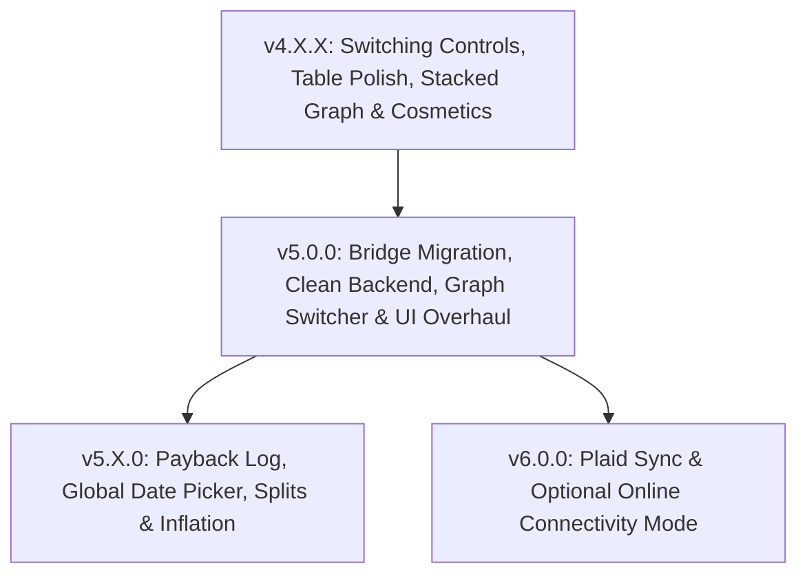

# Money Megaboard — Organized Update Plan
*Prepared for the Director by the Antigravity Agent*

This update plan outlines the feature development roadmap, separating functional enhancements from major structural shifts to preserve backwards-compatibility and version switching within the `v4.x.x` line, before migrating to an optimized architecture in `v5.0.0` and introducing online features in `v6.0.0`.

---

## 📅 Roadmap Overview

---

## 🛠️ v4.X.X (Minor Feature Releases & Polish)
*All changes in this phase must remain 100% compatible with the shared Flask backend, templates rendering, and virtual environment dependencies (e.g. keeping `pandas` in requirements.txt) so that historical version switching is not broken. Scope is limited to the current active major version.*

### 1. Version Switcher & Desktop Controls
*   **Smart Version Switcher Dropdown:** Filter the versions list inside the dropdown to only show versions starting with the current major version.
    *   Show only the highest patch version for any fully polished branch. (For example, if `v4.0.X` is polished, show only `v4.0.5` and hide `v4.0.0`-`v4.0.4`).
    *   Show all patches of the *latest active* branch that is currently being polished. (For example, if you are actively working on the `v4.1.X` branch, the dropdown will display `v4.1.0`, `v4.1.1`, and `v4.1.2` as they are created).
*   **Smart Changelog Parser:** Modify the Python backend to read `README.md` in the root, parse out the block corresponding to the active version string (e.g., `v4.0.5`), and serve it to the changelog box in `index.html`. This automates changelog updates.
*   **Quit & Restart Buttons:**
    *   **Quit:** A button in the UI that cleanly terminates the PyWebView window and tells the AppleScript runner loop to exit without rebooting.
    *   **Restart:** A button in the UI that writes `restart_flag` to the shared folder and exits the Python process, prompting the AppleScript loop to reboot the server instantly.
*   **Changelog & Directory Fixes (From Report Point 2):**
    *   **Interactive version bumper script:** Create `Development Tools/bump_version.py` to automate version incrementing, git commits, copying, and updating template changelogs.
    *   **Ignored version search (.cursorignore):** Add a `.cursorignore` file to ignore older version directories (e.g. `v4.0.0`-`v4.0.4`) from AI searches, preventing context waste.
    *   **Gitignore cleanup:** Edit `.gitignore` to only ignore log files (e.g., `mac commands/*.log`) instead of ignoring the entire `mac commands/` folder.
    *   **AppleScript logs redirection:** Modify [build.applescript](file:///Users/ben/Documents/projects/Money%20Megaboard/Antigravity/Development%20Tools/build.applescript#L47) to redirect launcher errors to a local log file `shared/launcher.log` instead of silencing them with `> /dev/null 2>&1`.

### 2. CSV Mapper & Data States
*   **Atomic Data Persistence (From Report Point 1):** Rebuild the settings load/save logic in [app.py](file:///Users/ben/Documents/projects/Money%20Megaboard/Antigravity/Current%20Project/versions/v4.0.5/app.py#L64-L95) to write to a temporary file and atomically rename it using `os.replace`. If a permission error occurs, wait or alert instead of deleting `app_data.json`.
*   **Automatic Personal Data Wipe on Exit:** On application quit, clear all processed transaction records, charts, and cached log files (`PayPal_Master_History.csv`, `PayPal_DEBUG_LOG.csv`) from the runtime directories to keep your data private.
*   **"Reset" Factory Restore Button:** Add a reset button next to Quit/Restart that wipes everything, including custom column mappings, category overrides, notes, and transfer rules.
*   **Automatic Mock Demo Mode:** If the application starts up and no user data is loaded, automatically parse and load a robust set of mock bank files (100+ transactions representing checking, savings, PayPal, transfers, and ghost accounts) stored in `Development Tools/Dummy CSVs/` so the app is fully functional out-of-the-box.
*   **Missing Data Validation:** Throw an error popup if an uploaded CSV lacks Date or Amount columns, instead of defaulting parsed amounts to $200.
*   **CSV Exports:**
    *   Add a button to download a combined Mega CSV containing all active accounts and ghost accounts.
    *   Add a button to export/download a JSON backup of all configurations/settings.

### 3. Graphs & Layouts
*   **Stacked Accounts Bar Graph:** Implement a stacked bar chart showing the balance breakdown of all accounts stacked together, with a toggle to show absolute dollar totals or percentage stacks. (Rendered inline in the template below/above existing charts).
*   **Graph Cosmetics:** Use straight lines instead of dashed lines for individual account charts. Add a text node showing the Net Worth total sum of whatever data points are currently visible on the graph.

### 4. Transactions Table & Categories
*   **Show All / Hide Junk Toggle:** Add a button in the UI to toggle the visibility of transactions that have been hidden programmatically or manually (e.g. `isHidden = true` transfer opposite legs, or manually hidden items). This toggle affects only local hidden visibility states and is completely distinct from PayPal backend removals.
*   **Combined Date Mode:** A table dropdown toggle for `[Individual, Monthly, Yearly, Combined]`. In combined mode, transactions with identical descriptions on the same account are aggregated into one row, replacing the Time column with `Oldest Date` and `Soonest Date` columns.
*   **Inline Filtering:** A text input cell above each column header. Typing in a cell instantly filters rows containing that text. The isolation checkbox changes to support `AND`/`OR` filtering combinations.
*   **Description Usability:** Ensure description cells allow native cursor text selection.
*   **Sorting:** Refine date and time sorting so they are evaluated together.
*   **Interactive Transfer Rules:**
    *   **Ghost Picker:** Allow multi-selecting rows in the table to bulk-assign them to a target Ghost Account.
    *   **Inline Quick Apply:** Add an 'Apply' button next to each custom transfer rule to immediately trigger and test that specific rule on current transactions.
*   **Wawa Smart Auto-Categorization:** Update the auto-categorizer to classify Wawa transactions > $20 as "Gas/Transportation" and <= $20 as "Food".

---

## 🧹 v5.0.0 (Major Architectural Overhaul)
*This release introduces breaking changes to the version switching framework and dependencies. When launching v5.0.0, all previous v4.X.X folders and their assets will be relocated to the `Old Versions/` archive, and the runner will transition to a clean backend.*

### 1. Graph Switcher Dropdown
*   Implement a clean UI select menu to toggle between views, reducing layout clutter:
    1.  Accounts and Net Worth line graph.
    2.  Income vs. Expenses bar graph.
    3.  Pie Charts.
    4.  Stacked Accounts Bar Graph (moved into the switcher).

### 2. PyWebView JS Bridge Migration (From Report Point 1)
*   Eliminate the Flask HTTP API endpoints and migrate all data transmission to the native PyWebView JS Bridge (`window.pywebview.api`).
*   This removes the need to open local network ports, making the application fully offline, sandboxed, and secure.

### 3. Prune Pandas & Package Optimization (From Report Point 1)
*   Rebuild the PayPal CSV sanitizer and clean-up functions in pure Python using standard libraries.
*   Remove `pandas` and `numpy` from requirements.txt, shrinking the standalone executable size by ~80% and making startup nearly instantaneous.

### 4. Centralize Match Rules (From Report Point 1)
*   Expose the keywords list from the backend or store it directly in `app_data.json` to avoid duplication between Python's `guess_category()` and Javascript's `KEYWORDS`. Make these defaults editable in the UI.

### 5. Frontend Performance Upgrades (From Report Point 1)
*   Rebuild table drawing using batch rendering/DocumentFragments to prevent DOM rendering bottlenecks and layout thrashing during sorting or filtering.

### 6. Visual Design Overhaul
*   **Dark Mode Toggle:** Shift from a plain white canvas to a sleek neon-themed dark mode interface.
*   **Glassmorphism styling:** Apply modern backdrop-filters, subtle gradients, and glass-effect containers.
*   **App Logo:** Build a dedicated icon/logo integration for the application shell.

### 7. Code Audit & Cleanup
*   Remove all deprecated code, unified colors residue, and old Javascript loops.
*   Compile a rolling feature list documentation file to maintain agent alignment on future modifications.

---

## 🚀 v5.X.0 (Post-Cleanup Feature Expansion)

*   **Payback Log:** A dedicated log/sub-tab to track money lent to friends, outstanding payback balances, and repayment transactions.
*   **Global Date Picker:** Relocate the start/end date inputs above the graph switcher container and bind them to filter the Net Worth graph, Pos/Neg graph, Pie Charts, Stacked Graph, and the transaction table globally.
*   **Draggable Transaction Splitter:** Introduce a visual receipt splitter. Click a transaction to open a draggable pie-chart/slider widget where you can split a single amount into multiple categories and type in exact receipt items.
*   **Inflation Adjustment Toggle:** Add a slider/toggle on the Net Worth chart to adjust historical balances using a configurable static yearly inflation rate (e.g. 3%).

---

## 🌐 v6.0.0 (Optional Online Connectivity & Syncing)

### 1. Clear Online Toggle
*   Provide a clear, explicit interface for the user to keep the application completely offline-only. 
*   If the user opts out of online features, the offline-only mode will not diminish or disrupt the core local dashboard experience.

### 2. Plaid Bank Sync
*   Secure OAuth integration for direct bank syncing (supporting Discover, Capital One, Venmo, subscription tracking, and credit card optimization alerts).
*   Implement a secure cloud-proxy microservice relay (e.g. via Cloud Functions) to exchange public tokens securely without packaging secret API client keys inside the local desktop app code.
